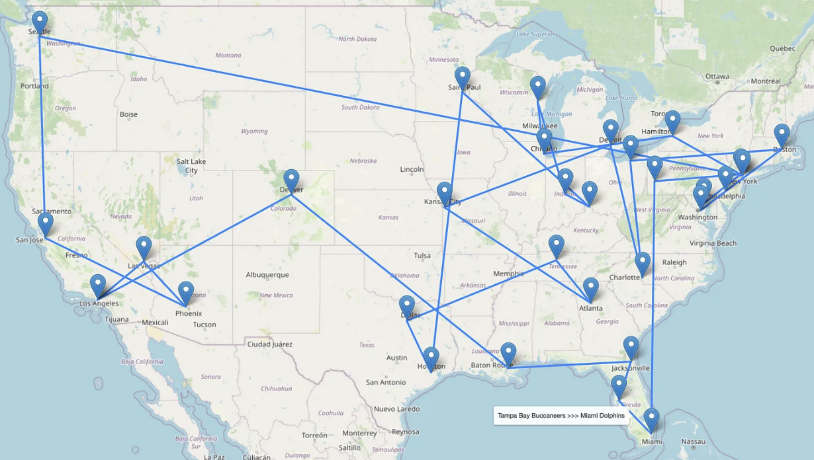

# jet-sweep

This repository contains my code for my route optimization project with the objective of designing an NFL fan's dream sabbatical: a cross country tour hitting every NFL stadium for a home game during the span of a season.

I wrote a nerdy deep dive article about this on Towards Data Science, a Medium publication. The link to that article is here: https://towardsdatascience.com/jet-sweep-route-optimization-to-visit-every-nfl-team-at-home-9a43e0bc4810

Mixed Integer Program Package & Solver: `puLP` CBC MILP

Model Inputs:
- Geocoordinates (latitude and longitude) of each NFL stadium | [scrape-wiki.py](./scripts/scrape-wiki.py)
- Mile matrix (computed using geodesic distance between each pair of coordinates) | [compute-distance-matrix.py](./scripts/compute-distance-matrix.py)
- 2024-25 NFL schedule to reference the dates of home games | [scrape-sportsreference.py](./scripts/scrape-sportsreference.py)

Route Visualization:
- I leveraged the `folium` Python package to plot the resulting route on an interactive map | [plot-route.py](./scripts/plot-route.py)

